# Project 5 - Dashboard World Health Data

### Contents:
- [Problem Statement](#Problem-Statement)
- [Data Dictionary](#Data-Dictionary)
- [Brief Summary of Analysis](#Brief-Summary-of-Analysis)
- [Conclusions and Recommendations](#Conclusions-and-Recommendations)

## Problem Statement

This project aims to explore paid leave across world countries and their effect on health and employment.

## Why is this important?

Paid Maternity Leave is an important issue as it affects mothers in particular, but also their families. Countries across the world have implemented various policies to support mothers and their careers, while others have no policies at all. In these cases, mothers rely on the private sector to do the right thing. Parental leave in general is something of utmost importance for quality of life.

## Data Dictionary

|Feature|Description|
|---|---|
|ppl_weeks|paid paternal leave, weeks|
|ppl_avg_pay_rate|paid paternal leave, average pay rate|
|ppl_full_equiv_weeks|paid paternal leave, fulltime equivalent weeks
|p_hcl_weeks|paternal homecare leave, weeks|
|p_hcl_avg_pr|paternal homecare leave, average pay rate|
|p_hcl_fe_wk|paternal homecare leave, fulltime equivalent, weeks|
|p_tpl_wk|total paternal parental leave, weeks|
|p_tpl_avg_pr|total paternal parental leave, average pay rate|
|p_tpl_fe_wk|total paternal parental leave, fulltime equivalent weeks|
|pml_weeks|paid maternal leave, weeks|
|pml_avg_pay_rate|paid maternal leave, average pay rate|
|pml_full_equiv_weeks|paid maternal leave, fulltime equivalent weeks|
|m_hcl_weeks|maternal homecare leave, weeks|
|m_hcl_avg_pr|maternal homecare leave, average pay rate|
|m_hcl_fe_wk|maternal homecare leave, fulltime equivalent weeks|
|m_tpl_wk|total maternal parental leave, weeks|
|m_tpl_avg_pr|total maternal parental leave, average pay rate|
|m_tpl_fe_wk|total maternal parental leave, fulltime equivalent weeks|

## Brief Summary of Analysis

Extensive data cleaning was done on the datasets. EDA was then conducted to view how family leave policies compare across countries and over the years. A model was created to predict health and employment indicators based on paid leave data from 2018.

*At a Federal/Government policy level, Bulgaria offers 1+ year of Paid Maternity Leave, while United States of America does not offer any. United Kingdom and Greece provide 40+ weeks. For the United States, there is no federal paid maternity leave — it’s left to the states to figure out. The only states with an active policy are California, Rhode Island, and New Jersey.*
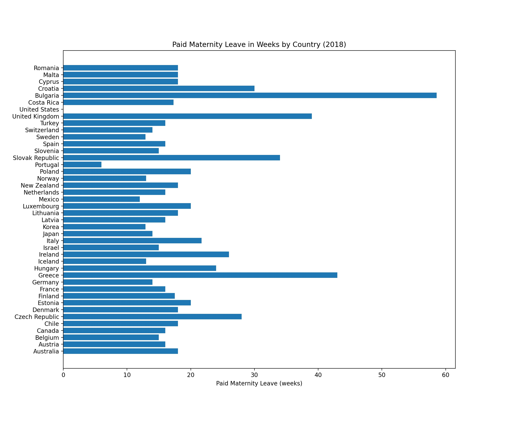

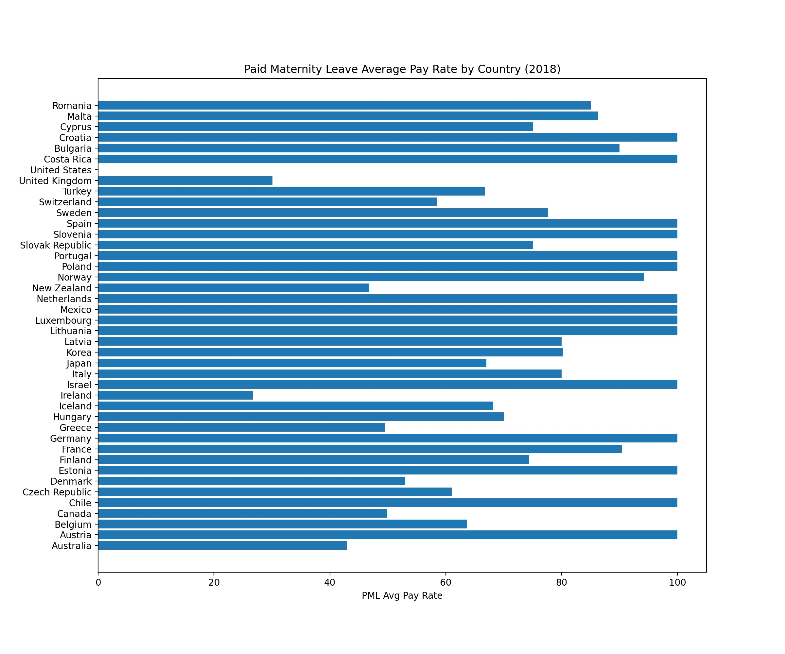

*How do countries do in matching the pay rate during Paid Maternity Leave to the actual pay outside PML? For example, while Portugal offers less number of weeks in PML, they do match at 100%. However, Bulgaria offers more weeks, but does not match the full pay rate. Croatia offers 30+ weeks and matches 100% of the pay rate.*
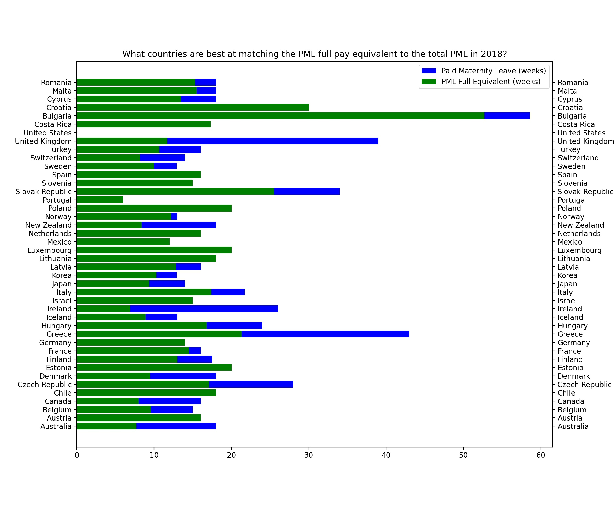

*How do countries do in matching the pay rate during Home Care Leave to the actual pay? There are several countries who do not have Home Care Leave policies in place. If they do, they do not match the pay rate as well as they do for paid maternity leave. For example, Austria (previous slide) matches PML 100%, but does not match HCL at the same rate. They do provide 48 weeks of HCL, but in terms of pay, this only amounts to 36.*
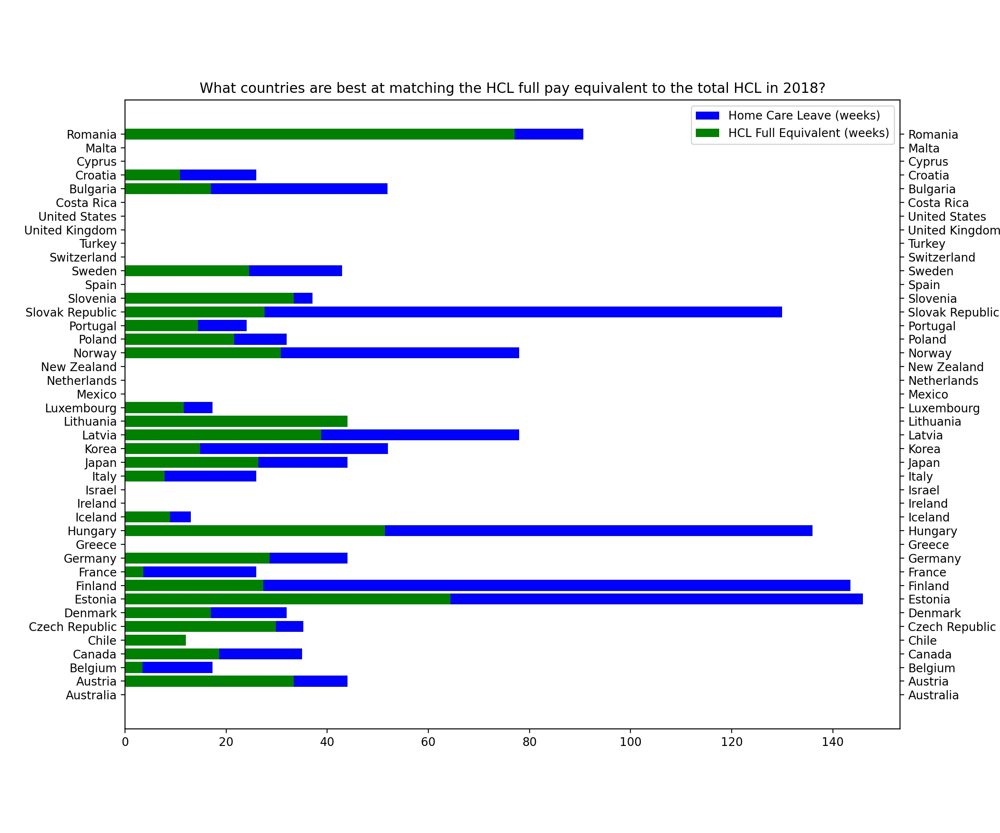

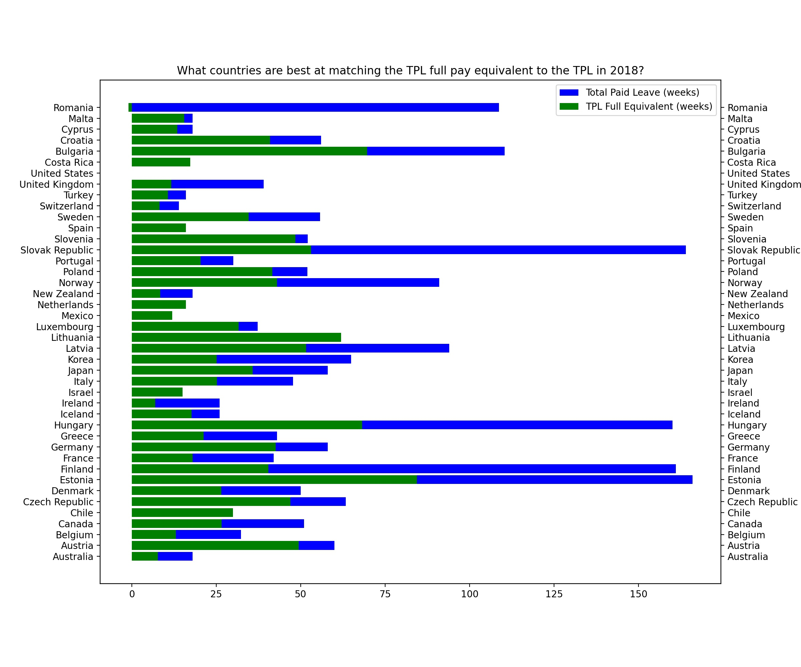

*Overall, we are moving in the right direction. The number of countries providing maternity leave benefits and policies has gone up over the years. In 2019, we observe the largest number, which is promising.*
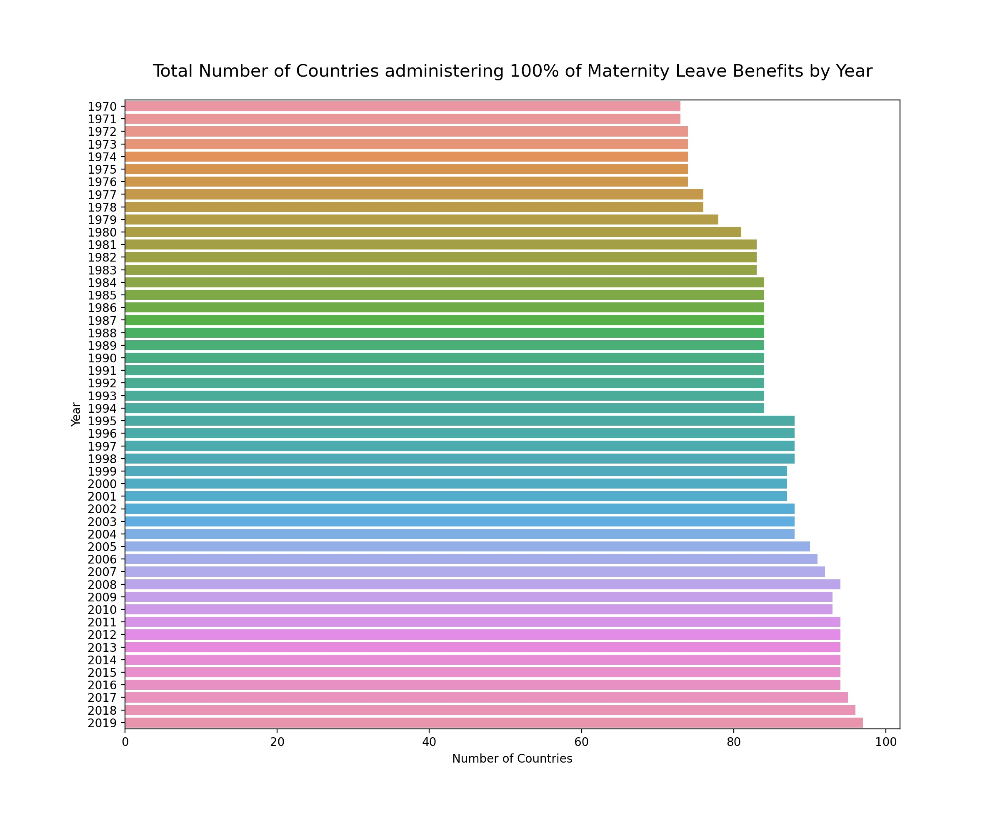

*The contrast across the world is high, with Paid Maternity Leave ranging from 90 weeks to 0.*
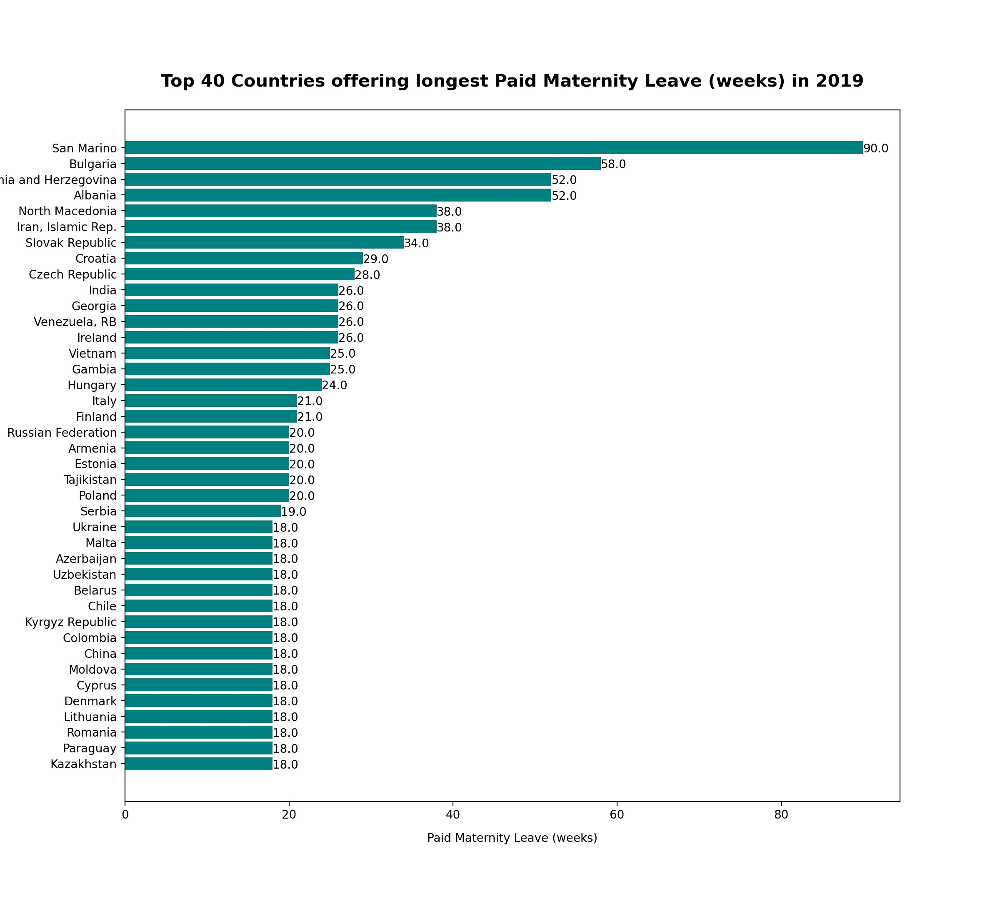
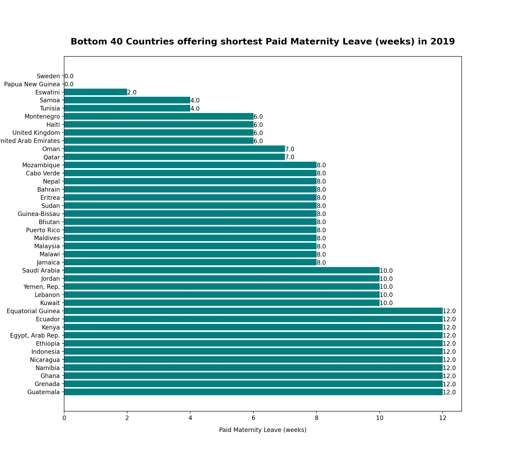  

*Education plays an important role in the employment rate of women across the globe. Here a are a few countries as an example.*
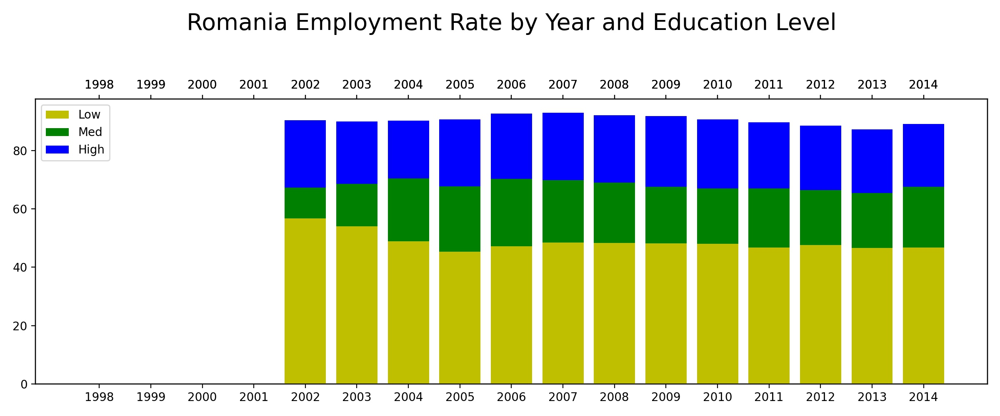
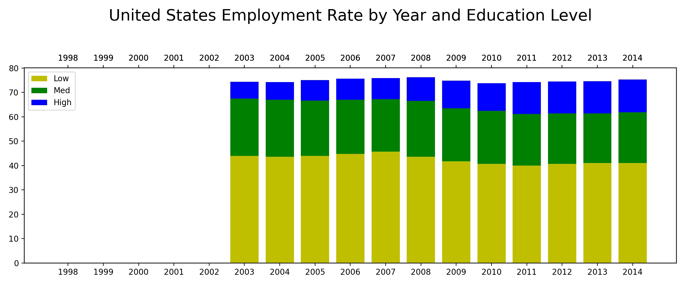
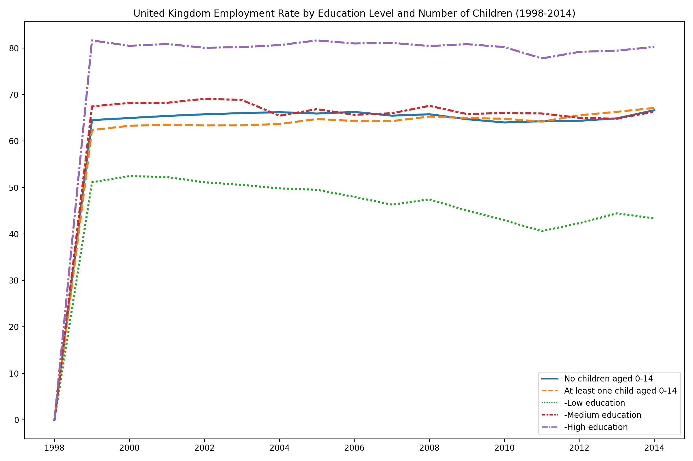
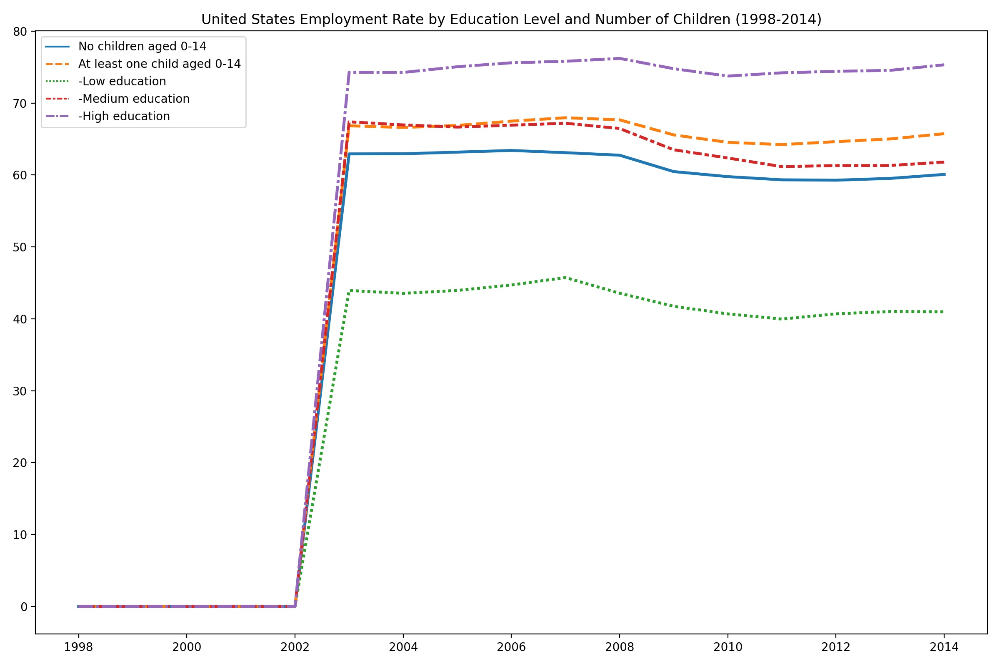

Linear regression model metrics and scores. Next steps: further tune this model (use a different type of model, engineer features, or try different variables).

Features: Paid Maternity Leave in 2018.  
Target: SP.DYN.IMRT.FE.IN for 2018.

|Metric|Value|
|---|---|
|RMSE|1.6161156581137364|
|MSE|2.6118298204003954|
|R2|-1.3726081701835429|
|MAE|1.1511250916559173|

|Score|Value|
|---|---|
|Train score|0.2217370187922929|
|Test score|-1.3726081701835429|
|Baseline|-3.249661790936785|

|Coefficient Name|Coefficient Value|
|---|---|
|pml_weeks|-0.080862|
|pml_avg_pay_rate|-0.007809|
|pml_full_equiv_weeks|0.129621|
|m_hcl_weeks|-0.007640|
|m_hcl_avg_pr|-0.013209|
|m_hcl_fe_wk|-0.022236|

|Indicator|Definition|
|---|---|
|SP.DYN.IMRT.FE.IN|Mortality rate, infant, female (per 1,000 live births)|
|SP.DYN.IMRT.MA.IN|Mortality rate, infant, male (per 1,000 live births)|
|SH.IMM.MEAS|Immunization, measles (% of children ages 12-23 months)|
|SH.IMM.IDPT|Immunization, DPT (% of children ages 12-23 months)|

**Resources:**

(1) [Maternity Leave Definitions](https://www.healthline.com/health/pregnancy/united-states-maternity-leave-facts#Maternity-leave-facts-in-the-United-States)  
(2) [How to deploy a Dashboard to Heroku](https://medium.com/analytics-vidhya/how-to-deploy-a-dashboard-to-heroku-3b458f321c93)

**Data Sources:**  

(1) [Maternity leave by country 2020](https://worldpopulationreview.com/country-rankings/maternity-leave-by-country)  
(2) [Weeks of paid leave by country 1990-2016](https://stats.oecd.org/index.aspx?queryid=54760)  
(3) [Child vaccination rates : OECD members](http://www.oecd.org/social/family/CO_1_4_Childhood_vaccination.xlsx)  
(4)[Childhood vaccination : Asia-Pacific](http://www.oecdkorea.org/resource/download/2019/eng/CO_1_4_Childhood_vaccination.xlsx)  
(5) [Breastfeeding rates : OECD members](http://www.oecd.org/social/family/43136973.xls)  
(6) [Low birth weights, 1960 - 2018 : OECD members](http://www.oecd.org/social/family/CO_1_3_Low_birth_weight.xlsx)  
(7) [Low birth weights, 1960 - 2018 : asia-pacific](http://www.oecdkorea.org/resource/download/2019/eng/CO_1_3_Low_birth_weight.xlsx)  
(8) [Maternal employment rates 1960 - 2019 : OECD members](http://www.oecd.org/els/soc/LMF_1_2_Maternal_Employment.xlsx)  
(9) [Maternal employment by partnership status 1960 - 2019 : OECD members](http://www.oecd.org/els/soc/LMF_1_3_Maternal_employment_by_partnership_status.xlsx)  